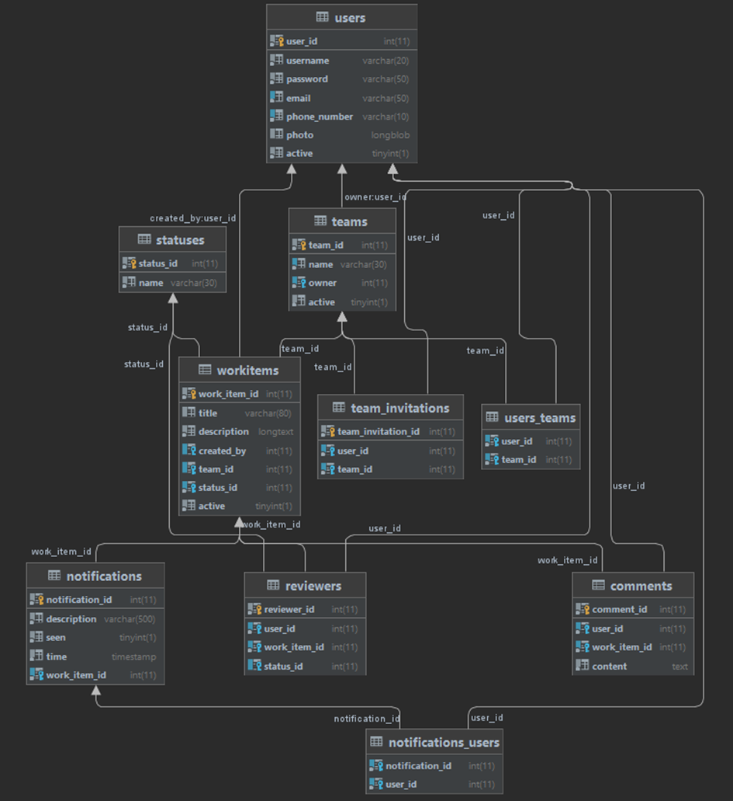

# Peer_Review_2021

Project Description
The members of every organization are responsible for the quality of the products. One mechanism for self-regulation and coverage of the organization's standards is the peer work review system. This could be in many forms, but in general it is a peer review of the submitted work item - code, tests, documents etc. The workflow is usually the following: user submits some work (code, documentation), assigns a reviewer, the reviewer can comment, approve, request changes, or decline the work item. Once the reviewer approves the work item it is marked as complete.
Registered users have private area accessible after successful login, where they could see all review requests that they have created, all review request where they are assigned as reviewers, a list of the teams the user is part of and a list of pending team invitations. The user has a main dashboard with additional information.
Users can login/logout and update their profile. Users are able to submit a work item, assign reviewers. Reviewers are part of the team where the work item is created. Users are able to see the list of all requests that they have created. The team members are able to view the newly created review request and its data. 
There are pending reviews for the user to do. There is a notification for changing the status of a task, for a comment. User can delete a notification.
The work item belongs to only one team.
The work item can have one of the following statuses: Pending, Under Review, Change Requested, Accepted, Rejected.
The user enters the title and description in a plain text form. On creation of the work item’s status is Pending. The other statuses are set by the reviewer.
User can rate or give a status for each worditem, as well as request a change.
A user can create a workitem, specify a reviewer, and comment on a workitem. Users participating in the review also receive a notification.
When a change is required, or the work item is rejected (by the reviewer) a comment can be added.
Users can create teams consisting of other users and can see a list of pending reviews assigned to them. The team  owner can add new members to the team. Every team member can see all the other team members.
Team members can invite other users into the team and each individual user can leave a team. The invited users receive notification.
Once a review request status is changed all reviewers and the assignee can receive a notification. 
The work item can have more than one reviewer. Statuses will be changed based on the accepted scenarios.
For the teams there is a list of users who are members, an option to include new users as members, an option to leave the team.
A user can see which teams he participates in, can create teams and invite other users as members, leave a team. If a user is the creator of a team, he has no right to leave it.

